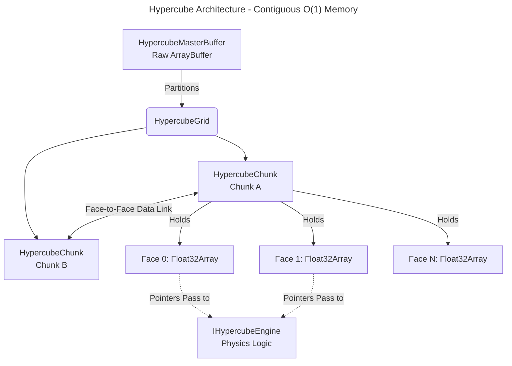

<div align="center">
  
  <h1>🌊 Hypercube Engine V4 🚀</h1>
  <p><strong>A GodMode O(1) Tensor-based Compute Engine for Web & Node.js</strong></p>
  
  [](https://www.npmjs.com/package/hypercube-compute)
  [](https://opensource.org/licenses/MIT)
  [](https://www.typescriptlang.org/)
</div>


## ⚡ Why Hypercube Engine?

Most physics or interactive simulations in JavaScript create thousands of objects (`[{x, y, vx, vy}, ... ]`). As the simulation grows, this leads to excessive CPU branching, **Garbage Collection (GC) pauses**, and cache misses. Eventually, the browser or Node process hangs.

**Hypercube Engine** turns this upside down. It uses a **Contiguous Memory Architecture** built on `Float32Array` or `SharedArrayBuffer`. 

By structuring state as mathematical tensors ("faces" of a cube) rather than discrete logical objects:
- Computations are naturally **vectorized**.
- Performance is consistently **O(1)**. 
- Memory allocations during the computing loops are exactly **0**.
- Multi-threading (via Web Workers & `SharedArrayBuffer`) and **WebGPU hardware acceleration** become trivial because all data is already in a raw binary buffer format.

If you are trying to implement **Cellular Automata, Fluid Dynamics (LBM), Heat Diffusion, or massive procedurally generated ecosystems** in JavaScript without resorting to C++ WebAssembly, Hypercube provides the high-performance memory layout you need.

---

## 🚀 Native 3D Compute (NEW in V4)

V4 introduces native 3D tensor support, allowing simulations to scale across `[nx, ny, nz]` dimensions while maintaining O(1) complexity.

### 🔥 Volume Diffusion Engine
A specialized 3D solver with a 7-point stencil and periodic boundaries. 
- **Hybrid Compute**: Support for both CPU (multithreaded) and **WebGPU hardware acceleration**.
- **Dynamic Limits**: Adapts workgroup sizes (256 to 1024 threads) based on the physical GPU adapter limits.
- **Applications**: Smoke, heat, chemical concentration, volumetric fog.
- **Performance**: 64³ grid (262k voxels) processed in ~3ms on CPU and <1ms on GPU (compute only). 128³ grid remains playable at 60 FPS on compatible hardware.

### 🎨 Visualization Helpers
- **IsoRenderer**: 2.5D Isometric projection on Canvas 2D with depth sorting.
- **MarchingCubes (Light)**: High-speed surface extraction for volumetric data.
- **ThreeJS Bridge**: Easy export to `THREE.Data3DTexture` and `BufferGeometry`.

---

## 🏗 Architecture Overview


---

## 🚀 Built-in Engines (The Showcase)

Hypercube comes out of the box with highly optimized, pre-built physics engines.

### 💨 Aerodynamics Engine (Lattice Boltzmann D2Q9)
A fully continuous computational fluid dynamics solver. 

**WEBGPU Performance**: The LBM engine is fully ported to WGSL, capable of 60 FPS simulations with complex vorticity calculations entirely on the GPU.


*Real-time fluid vorticity calculated at 60 FPS via WebGPU.*

### 🌊 Ocean Simulator
An open-world toric-bounded oceanic current simulator powered by the D2Q9 LBM Engine.

### 🗺️ Flow-Field Engine (V3)
A massive crowd pathfinding engine guiding 10,000+ agents to a target simultaneously via WebGPU parallel scan.

### 🧬 GameOfLife Ecosystem (O1 Tile)
Un automate cellulaire repensé en **écosystème organique cyclique**.

---

## 💡 Quick Start: See the "Wow" in 20 Lines
The easiest way to start is the **Game of Life** (O1 Ecosystem). Copy-paste this into an `index.ts`:

```typescript
import { HypercubeGrid, HypercubeMasterBuffer, GameOfLifeEngine, HypercubeViz } from 'hypercube-compute';

// 1. Setup Canvas & Memory
const canvas = document.querySelector('canvas')!;
const master = new HypercubeMasterBuffer(); 
const grid = await HypercubeGrid.create(1, 1, 128, master, () => new GameOfLifeEngine(), 3);

// 2. Main Loop
const loop = () => {
    grid.compute(); // Process tensor logic O(1)
    
    // 3. Render directly (Face 2 = Organic Density/Age)
    const faceData = grid.cubes[0][0].faces[2]; 
    HypercubeViz.quickRender(canvas, faceData, 128); // Plug & Play!
    
    requestAnimationFrame(loop);
};
loop();
```

### 💨 Want Fluid? (Ocean Engine)
To see vortices instead of cells, use the **Ocean Engine**:
```typescript
const grid = await HypercubeGrid.create(1, 1, 256, master, () => new OceanEngine(), 23);

const loop = () => {
    // Sync all LBM populations (Faces 0-8)
    grid.compute([0, 1, 2, 3, 4, 5, 6, 7, 8]); 

    const curl = grid.cubes[0][0].faces[21]; // Vorticity/Rotation
    HypercubeViz.renderToCanvas(canvas, curl, 256, 256, 'heat');
    
    requestAnimationFrame(loop);
};
```

---

## 🗺️ Engine & Face Dictionary
Hypercube uses **Faces** (tensor layers) instead of objects. 

| Engine | Face | Usage Snippet | Description |
| :--- | :--- | :--- | :--- |
| **GameOfLife** | `1` | `chunk.faces[1]` | **Discrete State** (0=Empty, 1=Plant, 2=Herbi, 3=Carni) |
| | `2` | `chunk.faces[2]` | **Density/Age** (0.0 to 1.0) - Perfect for "soft" renders |
| **Heatmap** | `0` | `chunk.faces[0]` | **Inputs** (binary sources) |
| | `2` | `chunk.faces[2]` | **Result** (Blurred spatial influence map) |
| **Ocean/LBM** | `18` | `chunk.faces[18]` | **Velocity X** (Horizontal current) |
| | `21` | `chunk.faces[21]` | **Curl/Vorticity** (Rotation/Eddies of the fluid) |
| | `22` | `chunk.faces[22]` | **Obstacles** (1.0 = Wall, 0.0 = Fluid) |
| **Vol. Diffusion** | `0` | `chunk.faces[0]` | **Input Concentration** (3D Grid) |

---

## ⚡ Live Interaction & Parameters
**Important**: All parameters can be changed **in live** without rebuilding the grid or the engine.

```typescript
const engine = grid.cubes[0][0].engine as VolumeDiffusionEngine;
engine.diffusionRate = 0.15; // Updated in the next grid.compute()
```

### 🎮 Mouse Interaction
Inject data (vortices, heat, etc.) directly into the tensors:
```typescript
canvas.onmousemove = (e) => {
    const engine = grid.cubes[0][0].engine as OceanEngine;
    engine.addVortex(grid.cubes[0][0].faces, e.offsetX, e.offsetY, 15.0); 
};
```

---

## ⚙️ Hardware Acceleration (WebGPU)

Hypercube auto-detects support, but for maximum perf:

### 🚀 Activate WebGPU
```ts
await HypercubeGPUContext.init(); // MUST call this first
const grid = await HypercubeGrid.create(..., 'gpu'); 
console.log(grid.isGpuReady); // Fallback to 'cpu' if hardware is unsupported
```

### 🧵 Multi-threading (SharedArrayBuffer)
Requires these server security headers:
- `Cross-Origin-Embedder-Policy: require-corp`
- `Cross-Origin-Opener-Policy: same-origin`

---

## 🌐 Live Demos
👉 **[View Interactive Multi-Engine Demo](https://helron1977.github.io/Hypercube-Compute/)**
- **Switch Engines**: Use the buttons to swap logic.
- **Interact**: Click and drag to create vortices or draw obstacles.
- **3D**: Check the `07-volume-diffusion-3d` example for volumetric rendering.

---

## 🤖 AI-Friendly Guidelines (For Copilots)
1. **Never use standard arrays** for physics. Use `chunk.faces[n]`.
2. Iterations must be flat: `const idx = y * size + x`. No `.map()`.
3. Stick to **GodMode V8** loops (raw C-style) for O(1) efficiency.

`Built with passion for high-performance creative computing.`
